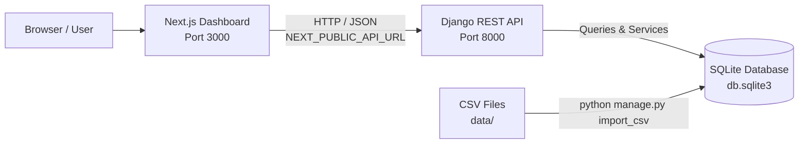

# AdosX Reconciliation Platform

An enterprise-grade, full-stack transaction reconciliation platform built with a **Django REST Framework** backend and a **Next.js (React 19 / TypeScript / Tailwind CSS / Radix UI)** frontend.

The platform ingests dirty financial and operational data from two independent upstream sources (**System A** and **System B**), enforces strict multi-tenant boundary isolation, deterministically identifies all categories of discrepancies, and presents them in an interactive audit dashboard with side-by-side inspection modals.

---

## 1. Features

### 🛠️ Ingestion & Dirty Data Resilience
* **Zero Dropped Rows:** The `import_csv` management command ingests dirty datasets containing missing columns, unparseable numbers, formatting artifacts (e.g. `"1,25,400.00"`), and references to nonexistent records (`REC-1999`) without dropping rows.
* **Reference Normalization:** Standardizes formatting anomalies (e.g. `" REC - 1070 "`, `"rec1034"`, `"1112"`) into canonical IDs (`REC-1070`, `REC-1034`, `REC-1112`).
* **Idempotent Execution:** Uses atomic transactions and `update_or_create` logic to allow safe re-execution without duplicate rows.

### ⚙️ Deterministic Reconciliation Engine
* **Case 1 — Missing in System B (`missing_in_system_b`):** Identifies System A records with no corresponding entry in System B.
* **Case 2 — Invalid System B Reference (`invalid_system_b_reference`):** Identifies System B entries pointing to nonexistent System A records.
* **Case 3 — Duplicate System B Entry (`duplicate_system_b_entry`):** Detects multiple System B entries referencing the same System A record without hiding original rows.
* **Case 4 — Value Mismatch (`value_mismatch`):** Identifies financial mismatches while honoring mathematical equivalence (e.g. `100` vs `100.00` or `"1,25,400.00"` is **not** falsely flagged).
* **Multi-Discrepancy Tagging:** Entries with multiple issues (e.g. duplicate entries that also have value mismatches) are flagged with all applicable reasons.

### 🏢 Strict Multi-Tenant Boundary Isolation
* Relational hierarchy: `Organization -> Location -> System A Records / System B Entries`.
* Discrepancies are scoped strictly per tenant. System B entries filed under `ORG-B` that reference System A records in `ORG-A` never leak across tenant boundaries.

### 💻 Next.js Reconciliation Dashboard
* **Interactive Summary Cards:** Clickable metric cards displaying total disagreements and per-category breakdowns.
* **Filter & Search Toolbar:** Filter by Discrepancy Reason, Organization Tenant (`ORG-A`, `ORG-B`), and search by Record ID, Location, or Entry ID.
* **Multi-Field Sorting:** Sort ascending or descending by System A Value, System B Value, or Record ID.
* **Side-by-Side Raw Data Modal:** Inspect any row to view comparative analysis, mapped fields, and complete raw JSON payloads.
* **Resilient UX Feedback:** Skeleton loaders, error retry actions, and empty-state indicators.

---

## 2. Tech Stack

| Layer | Technology | Version / Spec |
| :--- | :--- | :--- |
| **Frontend Framework** | Next.js (App Router) | `16.3.1` |
| **Frontend Library** | React / React DOM | `19.2.8` |
| **Language** | TypeScript | `^5` |
| **Styling & Icons** | Tailwind CSS v4 / Lucide React | `^4` / `^1.32.0` |
| **UI Primitives** | Radix UI (`@radix-ui/react-dialog`) / shadcn UI patterns | `^1.1.23` |
| **Backend Framework** | Django / Django REST Framework | `6.1` / `3.18.0` |
| **Python Runtime** | Python | `>= 3.12` |
| **Python Package Manager** | `uv` (Astral) | Latest |
| **Database** | SQLite | 3 (via `backend/db.sqlite3`) |
| **Containerization** | Docker & Docker Compose | Compose file version `3.8` |

---

## 3. Project Architecture

The system consists of a Next.js frontend communicating over HTTP with a Django REST API, which queries an SQLite database populated by the CSV importer.



### Port Mappings
* **Frontend Dashboard:** [http://localhost:3000](http://localhost:3000)
* **Backend REST API:** [http://localhost:8000](http://localhost:8000)
  * Disagreements Endpoint: [http://localhost:8000/api/disagreements/](http://localhost:8000/api/disagreements/)
  * Summary Endpoint: [http://localhost:8000/api/summary/](http://localhost:8000/api/summary/)

---

## 4. Pre-Flight Environment Check

A pre-flight checker script is included to inspect your environment and verify installed tools (Docker, Docker Compose, Python, `uv`, Node.js, `npm`):

* **Linux / macOS:**
  ```bash
  chmod +x check_env.sh
  ./check_env.sh
  # or:
  bash check_env.sh
  ```

* **Windows (Command Prompt / PowerShell):**
  ```cmd
  check_env.bat
  ```
  ```powershell
  .\check_env.bat
  ```

The script checks your dependencies and recommends whether to use **Option A (Docker)** or **Option B (Local Run)**.

---

## 5. How to Run the Project

### Option A: Run with Docker (Recommended — Zero Local Dependencies)

Starts both the Django backend and Next.js frontend in containers, runs database migrations, and imports the CSV datasets automatically:

```bash
docker compose up --build
```

Once started:
* Open **Frontend Dashboard:** [http://localhost:3000](http://localhost:3000)
* Access **Backend API:** [http://localhost:8000/api/disagreements/](http://localhost:8000/api/disagreements/)

To stop the containers:
```bash
docker compose down
```

---

### Option B: Run Locally Without Docker

#### Prerequisites
* **Python 3.12+** and **`uv`** package manager ([Install uv](https://docs.astral.sh/uv/))
* **Node.js 18+ or 20+** and **`npm`**

#### Step 1: Start Backend (Terminal 1)
```bash
cd backend

# 1. Install dependencies with uv
uv sync

# 2. Run database migrations
uv run python manage.py migrate

# 3. Ingest CSV datasets
uv run python manage.py import_csv

# 4. Start Django development server
uv run python manage.py runserver
```
The backend API is now live at [http://127.0.0.1:8000](http://127.0.0.1:8000).

#### Step 2: Start Frontend (Terminal 2)
```bash
cd frontend

# 1. Install dependencies
npm install

# 2. Start Next.js development server
npm run dev
```
The frontend dashboard is now live at [http://localhost:3000](http://localhost:3000).

---

## 6. Why We Use `migrate` and `import_csv`

When running the project locally or setting up fresh environments, two commands must be run:

1. **`python manage.py migrate`**:
   - **What it does:** Creates the relational schema and tables inside SQLite (`db.sqlite3`).
   - **Why it is needed:** SQLite starts as an empty database file. Running `migrate` creates tables for `Organization`, `Location`, `SystemARecord`, and `SystemBEntry`.

2. **`python manage.py import_csv`**:
   - **What it does:** Reads the raw datasets (`locations.csv`, `system_a.csv`, `system_b.csv`) from the `data/` directory and populates the SQLite database.
   - **Why it is needed:** The reconciliation engine and REST API query the database to compare records. Running `import_csv` loads the dataset so data is available on the dashboard.
   - **Safe to re-run:** The importer is idempotent (uses `update_or_create`), meaning you can re-run it at any time without creating duplicate records.

---

## 7. API Reference

### 1. `GET /api/disagreements/`
Returns the list of identified reconciliation discrepancies between System A and System B.

#### Query Parameters
| Parameter | Type | Description | Example |
| :--- | :--- | :--- | :--- |
| `reason` | string | Filter by discrepancy reason (`missing_in_system_b`, `invalid_system_b_reference`, `duplicate_system_b_entry`, `value_mismatch`) | `?reason=value_mismatch` |
| `org_id` | string | Enforce tenant boundary filtering (`ORG-A`, `ORG-B`) | `?org_id=ORG-A` |
| `location_id` | string | Filter by specific location ID | `?location_id=LOC-101` |
| `ordering` | string | Sort by field (`system_a_value`, `-system_a_value`, `system_b_value`, `-system_b_value`, `record_id`, `-record_id`) | `?ordering=-system_a_value` |

#### Example Response
```json
[
  {
    "record_id": "REC-1003",
    "reason": "value_mismatch",
    "reasons": ["value_mismatch"],
    "system_a_value": "121388.01",
    "system_b_value": "94834.38",
    "location_id": "LOC-202",
    "location_name": "Location 202",
    "org_id": "ORG-B",
    "entry_id": "ENT/2026/4003"
  }
]
```

### 2. `GET /api/summary/`
Returns aggregate summary statistics of records and discrepancies.

#### Query Parameters
| Parameter | Type | Description | Example |
| :--- | :--- | :--- | :--- |
| `org_id` | string | Optional tenant filter | `?org_id=ORG-A` |
| `location_id` | string | Optional location filter | `?location_id=LOC-101` |

#### Example Response
```json
{
  "total_disagreements": 14,
  "by_reason": {
    "missing_in_system_b": 3,
    "value_mismatch": 5,
    "duplicate_system_b_entry": 4,
    "invalid_system_b_reference": 2
  },
  "total_system_a_records": 120,
  "total_system_b_entries": 121
}
```

---

## 8. Running Tests & Quality Checks

### Backend Automated Tests
The backend includes unit and integration tests covering reference normalization, numerical equivalence, dirty data import, multi-tenant isolation, and API endpoints:

```bash
cd backend
uv run python manage.py test
```

### Frontend Linting & Build
```bash
cd frontend
npm run lint
npm run build
```

---

## 9. Project Structure

```text
.
├── check_env.sh                 # Environment checker for Linux / macOS
├── check_env.bat                # Environment checker for Windows
├── docker-compose.yml           # Multi-container orchestration (Django + Next.js)
├── docker/
│   ├── Dockerfile.backend       # Multi-stage Python 3.12 + uv backend container
│   └── Dockerfile.frontend      # Node 20 Next.js frontend container
├── data/
│   ├── locations.csv            # Location and organization metadata
│   ├── system_a.csv             # Raw System A transaction records
│   └── system_b.csv             # Raw System B transaction entries
├── backend/
│   ├── pyproject.toml           # Python dependencies (managed via uv)
│   ├── uv.lock                  # Deterministic dependency lockfile
│   ├── manage.py                # Django management entrypoint
│   ├── config/                  # Django project configuration (settings, URLs, WSGI)
│   └── reconciliation/          # Core reconciliation app
│       ├── models.py            # Organization, Location, System A & B models
│       ├── services.py          # Deterministic reconciliation & normalization engine
│       ├── views.py             # DRF views for disagreements and summary
│       ├── serializers.py       # DRF serializers
│       ├── middleware.py        # Custom CORS middleware
│       ├── tests.py             # Comprehensive test suite
│       └── management/commands/
│           └── import_csv.py    # Resilient CSV ingestion command
└── frontend/
    ├── package.json             # Next.js & React dependencies
    ├── next.config.ts           # Next.js configuration
    ├── app/
    │   ├── layout.tsx           # Global root layout
    │   ├── page.tsx             # Main reconciliation dashboard page
    │   └── globals.css          # Tailwind CSS styles
    ├── components/
    │   ├── reconciliation/      # Dashboard widgets (table, stats, modal, filters)
    │   └── ui/                  # Reusable UI primitives (dialog, button, table, etc.)
    ├── lib/
    │   ├── api.ts               # API client methods
    │   └── utils.ts             # Styling helpers (clsx, tailwind-merge)
    └── types/
        └── reconciliation.ts    # TypeScript interfaces
```

---

## 10. Frequently Asked Questions (FAQ)

### 1. How do I verify my local environment before running?
Run `./check_env.sh` (Linux/macOS) or `check_env.bat` (Windows). The script verifies Docker, Python, `uv`, Node.js, and `npm` and tells you the best way to run the project.

### 2. Why does the dashboard show "0 Disagreements" or empty tables?
Ensure you have executed the data import command in the backend:
```bash
cd backend
uv run python manage.py import_csv
```

### 3. Do I need to run `migrate` or `import_csv` when using Docker?
No. The `docker-compose.yml` file is configured to run `migrate` and `import_csv` automatically before starting the development server.

### 4. What happens when the server is stopped and restarted?
* **Local Run:** Data persists in `backend/db.sqlite3`. You only need to run `import_csv` again if you delete `db.sqlite3` or update the CSV source files.
* **Docker:** Data persists in the container filesystem and mounted volumes during container restarts.

### 5. Can `import_csv` be run multiple times?
Yes. The command uses `update_or_create` logic, making it safe to re-run without creating duplicate records.
